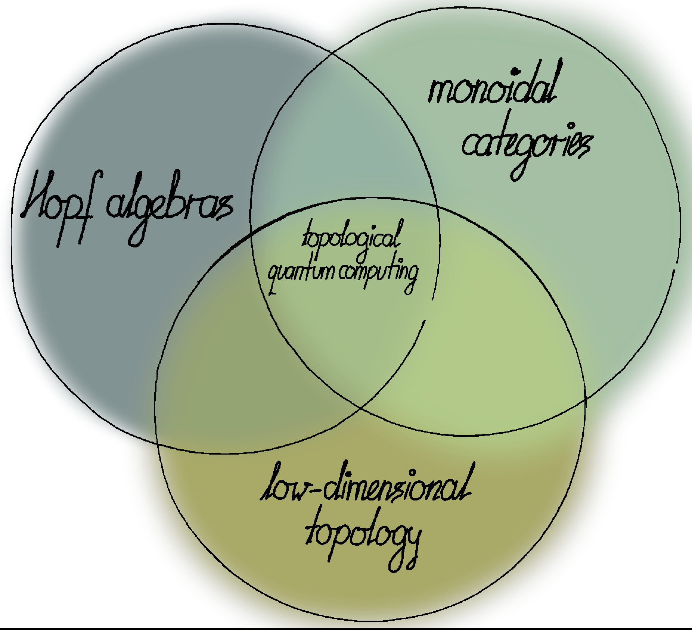

#+bibliography: ~/Documents/mathematics/literature/literature.bib
#+HTML_HEAD: <link rel="stylesheet" href="./tufte.css" type="text/css" />
@@html:

  <a href="index.html">Sebastian Halbig</a>
  
    <a href="publications.html">Publications</a>
    <a href="teaching.html">Teaching</a>
    <a href="games/braid-trivialiser.html">Math games</a>
    <a href="cv.html">CV</a>
  

@@
#+ATTR_HTML: :alt Zoomed image.
#+ATTR_HTML: :width 30% :style border:2px solid black; float: right; margin-right: -25%;
[[./IMG_20250321_173154.jpg]]

Hi, I'm Sebastian.
I am a mathematician working in the field of /quantum algebra/.
Currently, I hold a postdoctoral position in the group of [[https://www.uni-marburg.de/en/fb12/research-groups/algeblie][Istvan Heckenberger]] at the University of Marburg.

You can reach me via mail: [[mailto:Sebastian.Halbig@uni-marburg.de][Sebastian.Halbig@uni-marburg.de]]

** About my research

My research interests are:
+ *Hopf algebras and their representation theory:*
  I study structural and representation-theoretic properties of /Hopf algebras/ and their relatives (such as /comodule algebras/). /Braidings/, and therefore solutions of the /Yang–Baxter/ and /reflection equation/ play a prominent role in this part of my research.

+ *Category theory:*
  I investigate the /monadic reconstruction/ of /(braided) mononoidal and module categories/. Another strand of my research concerns itself with various forms of /dualisabilities/ and their representation-theoretic applications.

+ *Topological quantum computing:*
  I explore the algebraic side of  of /non-semisimple TQC models/, in particular the /Kitaev quantum double model/ with the goal of establishing a  homological interpretation of these constructions.

#+ATTR_HTML: :alt Zoomed image.
#+ATTR_HTML: :width 50% :style border:2px solid black;

#+OPTIONS: toc:nil
